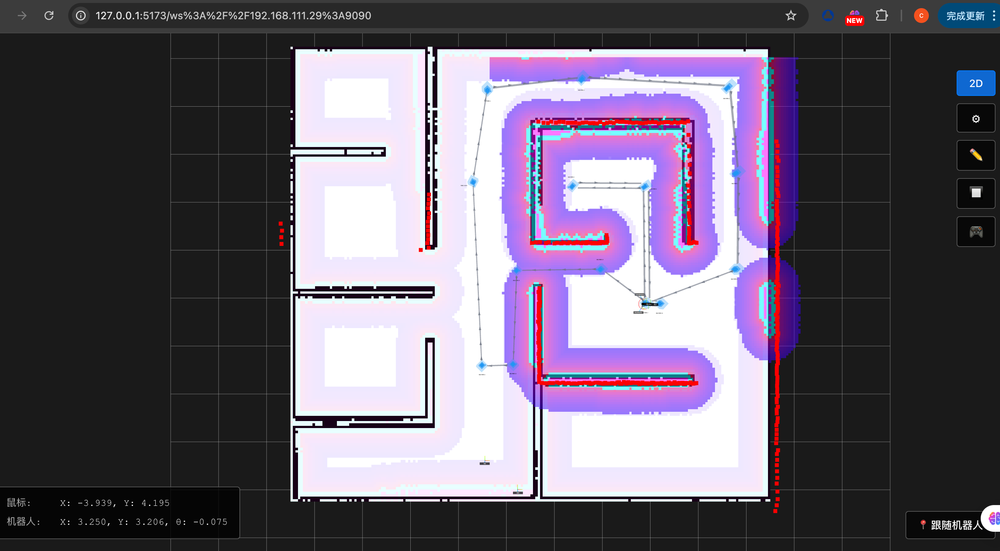
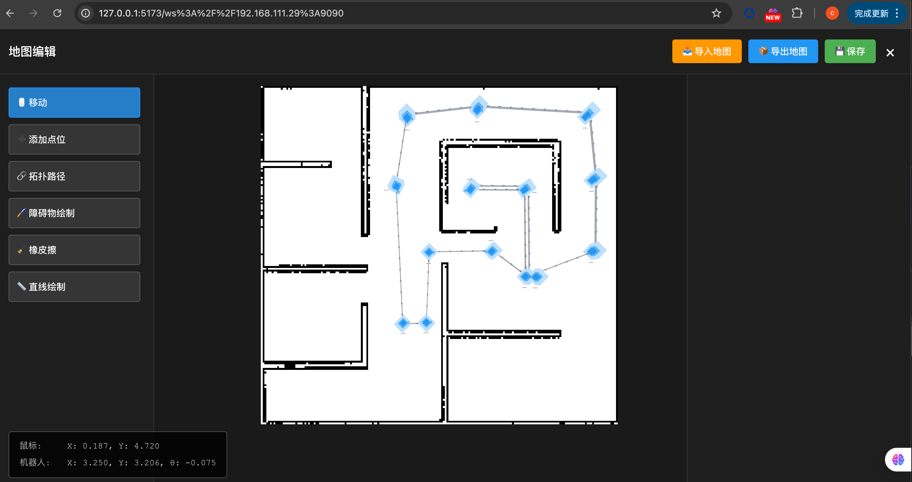
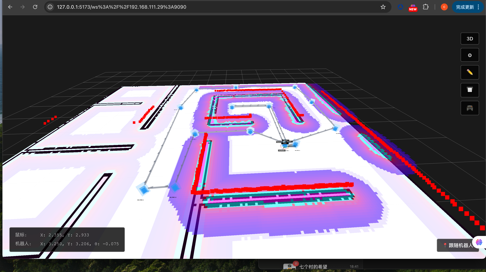

<!--
 * @Author: chengyangkj chengyangkj@qq.com
 * @Date: 2024-01-15
 * @LastEditors: chengyangkj chengyangkj@qq.com
 * @LastEditTime: 2024-01-15
 * @FilePath: /ros_web_gui_app/README.md
-->
<div align="center">

# ROS Web GUI APP

*基于 React + TypeScript + Vite 构建的 ROS 机器人可视化与地图编辑 Web 应用*

[简体中文](./README.md) | [English](./README_en.md)

[](https://github.com/chengyangkj/ros_web_gui_app/commits/main)
[](https://github.com/chengyangkj/ros_web_gui_app/stargazers)
[](https://github.com/chengyangkj/ros_web_gui_app/network/members)
[](https://github.com/chengyangkj/ros_web_gui_app/issues)
[](LICENSE)


</div>

## 📖 简介

本项目基于 React + TypeScript + Vite 构建，通过 rosbridge WebSocket 协议连接 ROS 1 或 ROS 2 系统，提供实时地图可视化、拓扑地图编辑、机器人位置跟踪等功能。所有功能均为自行绘制实现，可在浏览器中直接运行，无需安装额外软件。

### ✨ 功能特性

- **地图可视化**
  - 栅格地图（Occupancy Grid）显示
  - 局部/全局代价地图可视化
  - 激光雷达扫描数据可视化
  - 机器人位置与路径规划显示

- **拓扑地图编辑**
  - 添加/删除/编辑导航点位
  - 创建拓扑路径连接
  - 路径属性配置（控制器、目标检查器、速度限制）
  - 地图导入/导出功能

- **机器人跟踪**
  - 实时显示机器人位置
  - 跟随机器人视角
  - TF 坐标系可视化

- **视图模式**
  - 2D/3D 视图切换
  - 全屏模式
  - 图层配置与管理

### 🖼️ 界面预览






## 🚀 快速开始

### 环境要求

- **Node.js**: >= 20.19.0 或 >= 22.12.0
- **npm**: >= 9.0.0 或 yarn >= 1.22.0
- **ROS 环境**: ROS 1 或 ROS 2 系统（需要运行 rosbridge_server）

## 📥 安装依赖

### Windows

1. **访问 Node.js 官网**
   - 打开 [https://nodejs.org/](https://nodejs.org/)
   - 下载 LTS 版本（推荐）

2. **安装 Node.js**
   - 运行下载的安装程序
   - 按照向导完成安装（默认会包含 npm）

3. **验证安装**
   ```bash
   node --version
   npm --version
   ```

### macOS


```bash
# 下载并安装 nvm：
curl -o- https://raw.githubusercontent.com/nvm-sh/nvm/v0.40.3/install.sh | bash
# 代替重启 shell
\. "$HOME/.nvm/nvm.sh"
# 下载并安装 Node.js：
nvm install 24
# 验证 Node.js 版本：
node -v # Should print "v24.11.1".
# 验证 npm 版本：
npm -v # Should print "11.6.2".
```

**或下载安装包：**
- 访问 [https://nodejs.org/](https://nodejs.org/) 下载 macOS 安装包
- 运行安装程序完成安装

**验证安装：**
```bash
node --version
npm --version
```

### Linux

**Ubuntu/Debian：**
```bash
curl -fsSL https://deb.nodesource.com/setup_20.x | sudo -E bash -
sudo apt-get install -y nodejs
```

**CentOS/RHEL：**
```bash
curl -fsSL https://rpm.nodesource.com/setup_20.x | sudo bash -
sudo yum install -y nodejs
```

**验证安装：**
```bash
node --version
npm --version
```

## 🚀 编译与使用

### 安装步骤

1. **克隆项目**
```bash
git clone https://github.com/chengyangkj/ros_web_gui_app.git
cd ros_web_gui_app
```

2. **安装依赖**
```bash
npm install
```

## 🎮 运行说明

### 开发模式

启动开发服务器：
```bash
npm run dev
```

应用将在 `http://localhost:5173` 启动（Vite 默认端口）。

### 生产构建

构建生产版本：
```bash
npm run build
```

构建产物将输出到 `dist/` 目录。

预览生产构建：
```bash
npm run preview
```

### ROS 环境准备

在运行应用之前，需要确保 ROS 系统已启动 rosbridge_server：

**ROS 1:**
```bash
rosrun rosbridge_server rosbridge_websocket
```

**ROS 2:**
```bash
ros2 run rosbridge_server rosbridge_websocket
```

默认情况下，rosbridge_server 会在 `ws://localhost:9090` 启动 WebSocket 服务。

## 📚 使用说明

### 项目部署

#### 从 Release 下载编译产物

1. 访问项目的 [Releases 页面](https://github.com/chengyangkj/ros_web_gui_app/releases)
2. 下载最新版本的 `dist.zip` 或 `dist.tar.gz` 压缩包
3. 解压到本地目录，例如：
   ```bash
   unzip dist.zip -d ros_web_gui_app
   cd ros_web_gui_app
   ```

#### 启动简易服务器

使用 Python 内置的 HTTP 服务器启动：

```bash
python3 -m http.server 8001
```

服务器启动后，在浏览器中访问：
- **本地访问**：`http://localhost:8001`
- **局域网访问**：`http://<服务器IP>:8001`

> **注意**：Python 的 `http.server` 仅适用于开发和测试环境。生产环境建议使用 Nginx、Apache 等专业的 Web 服务器。

### 连接 ROS 系统

1. 启动应用后，在连接页面输入：
   - **IP 地址**：运行 rosbridge_server 的机器 IP（本地使用 `localhost`）
   - **端口**：rosbridge WebSocket 端口（默认 `9090`）

2. 点击"连接"按钮建立连接

3. 连接成功后，将自动跳转到地图视图

### 地图视图操作

#### 视图控制

- **2D/3D 切换**：点击顶部工具栏的 `2D`/`3D` 按钮切换视图模式
- **全屏模式**：点击 `🔲` 按钮进入/退出全屏
- **跟随机器人**：点击底部 `📍 跟随机器人` 按钮，视角将跟随机器人移动

#### 图层管理

点击 `⚙` 按钮打开图层设置面板，可以：
- 启用/禁用各个图层
- 调整图层颜色、透明度等属性
- 配置图层主题和话题

#### 地图编辑

点击 `✏️` 按钮打开地图编辑器，提供以下功能：

**工具说明：**
- **移动**：拖拽点位移动位置，右键拖拽旋转方向
- **添加点位**：点击空白区域添加新的导航点
- **拓扑路径**：点击两个点位创建路径连接
- **障碍物绘制**：使用画笔工具绘制障碍物
- **橡皮擦**：擦除障碍物
- **直线绘制**：绘制直线障碍物

**点位属性：**
- 名称、X、Y、Theta（方向角）
- 支持删除点位

**路径属性：**
- 起点/终点
- 控制器（从 support_controllers 下拉选择）
- 目标检查器（从 support_goal_checkers 下拉选择）
- 速度限制
- 支持删除路径

**地图操作：**
- **保存**：保存拓扑地图并发布到 ROS 系统
- **导入地图**：从 zip 文件导入栅格地图和拓扑地图
- **导出地图**：导出当前地图为 zip 文件
- **添加机器人位置**：将当前机器人位置添加为导航点

### 拓扑地图操作

#### 查看点位/路径信息

- 在地图视图中点击点位或路径，右侧会显示详细信息面板
- 点击导航点信息面板中的"单点导航"按钮，可以发布导航目标

#### 编辑拓扑地图

1. 点击 `✏️` 进入编辑模式
2. 使用工具栏选择编辑工具
3. 在地图上进行编辑操作
4. 编辑完成后点击 `💾 保存` 保存更改

## 📡 主要话题

应用订阅的主要 ROS 话题：

- `/map` - 栅格地图（nav_msgs/OccupancyGrid）
- `/map/topology` - 拓扑地图（topology_msgs/TopologyMap）
- `/local_costmap/costmap` - 局部代价地图
- `/global_costmap/costmap` - 全局代价地图
- `/scan` - 激光雷达扫描（sensor_msgs/LaserScan）
- `/plan` - 全局路径规划（nav_msgs/Path）
- `/local_plan` - 局部路径规划（nav_msgs/Path）
- `/local_costmap/published_footprint` - 机器人足迹（geometry_msgs/PolygonStamped）

应用发布的话题：

- `/map/topology/update` - 拓扑地图更新
- `/map/update` - 栅格地图更新
- `/goal_pose` - 导航目标（geometry_msgs/PoseStamped）

## 🛠️ 技术栈

- **前端框架**：React 19 + TypeScript
- **构建工具**：Vite
- **3D 渲染**：Three.js
- **ROS 通信**：roslib.js + rosbridge WebSocket
- **消息序列化**：[@lichtblick/rosmsg](https://www.npmjs.com/package/@lichtblick/rosmsg), [@lichtblick/rosmsg-serialization](https://www.npmjs.com/package/@lichtblick/rosmsg-serialization)（来自 [Lichtblick](https://github.com/lichtblick-suite/lichtblick) 生态）

## 💻 开发

### 项目结构

```
src/
├── components/          # React 组件
│   ├── MapView.tsx     # 主地图视图
│   ├── MapEditor.tsx   # 地图编辑器
│   └── layers/         # 图层组件
├── utils/              # 工具函数
│   ├── RosbridgeConnection.ts  # ROS 连接管理
│   ├── MapManager.ts   # 地图数据管理
│   └── tf2js.ts        # TF 变换处理
└── types/              # TypeScript 类型定义
```


## 📊 Star 历史

<div align="center">
  <picture>
    <source media="(prefers-color-scheme: dark)" srcset="https://api.star-history.com/svg?repos=chengyangkj/ros_web_gui_app&type=Timeline&theme=dark" />
    <source media="(prefers-color-scheme: light)" srcset="https://api.star-history.com/svg?repos=chengyangkj/ros_web_gui_app&type=Timeline" />
    
  </picture>
</div>

## 🤝 贡献

欢迎提交 [Issues](https://github.com/chengyangkj/ros_web_gui_app/issues) 和 [Pull Requests](https://github.com/chengyangkj/ros_web_gui_app/pulls)！

如果有什么想法或者建议，欢迎提交 Issue，说不定哪天就实现了呢！

### 贡献指南

1. Fork 本仓库
2. 创建特性分支 (`git checkout -b feature/AmazingFeature`)
3. 提交更改 (`git commit -m 'Add some AmazingFeature'`)
4. 推送到分支 (`git push origin feature/AmazingFeature`)
5. 开启 Pull Request

## 📄 开源协议

本项目采用 [CC BY-NC-SA 4.0](LICENSE) 许可证（知识共享署名-非商业性使用-相同方式共享 4.0 国际许可协议）。

**重要说明：**
- ✅ **允许**：学习、研究、个人使用
- ✅ **允许**：修改和分发，但必须保留原项目署名
- ❌ **禁止**：商业用途
- 📝 **要求**：基于本项目的衍生作品必须采用相同许可证，并附上原项目链接

详情请参阅 [LICENSE](LICENSE) 文件。

## 🙏 特别致谢

- 特别感谢 [Lichtblick](https://github.com/lichtblick-suite/lichtblick) 项目提供的开源可视化与消息处理方案，本项目在消息类型与序列化（[@lichtblick/rosmsg](https://www.npmjs.com/package/@lichtblick/rosmsg)、[@lichtblick/rosmsg-serialization](https://www.npmjs.com/package/@lichtblick/rosmsg-serialization)）

感谢所有贡献者和使用者的支持！